# TM - Требования безопасности + Модель угроз + ADR

---

## 0) Мета

- **Описание:** селлерская часть маркетплейса: веб-кабинет и API для управления товарами/остатками/ценами/скидками, с интеграциями во внешние провайдеры (платёж/выплаты, налоги). Используют продавцы.
- **Группа:** Беловицкий Владислав, Жулин Артем, Кочнев Виктор, Сергеев Илья, Сидоренков Олег 

---

## 1) Архитектура и границы доверия

1.1 Роли и активы:

- **Акторы:** Продавец.
- **Активы:** Каталог (SKU), цены и скидки, идентификаторы и секреты (JWT/refresh, API-токены, webhook-секреты), аудит, ПДн (PII).

1.2 Зоны доверия:

- **Internet:** UI клиент (U)
- **DMZ:** API Gateway/Ingress (A)
- **Internal:** Catalog & Prices (S), PostgreSQL (D)
- **External:** Платёжный провайдер (PSP), Налоговый провайдер (TAX), Агрегатор доставки (SHP)

1.3. Context/DFD:

```mermaid
flowchart LR
  %% --- Trust boundaries ---
  subgraph Internet[Интернет / Внешние клиенты]
    U[Seller Web UI / API Client]
  end

  subgraph DMZ[DMZ / Публичный периметр]
    A[API Gateway / Ingress]
  end

  subgraph Service[Сервис - приложение]
    S[Seller Service<br/>Catalog & Prices]
    D[(PostgreSQL)]
  end

  subgraph External[Внешние провайдеры]
    PSP[Payment Provider]
    TAX[Tax Service]
    SHP[Shipping Aggregator]
  end

  %% --- Основные потоки ---
  U -- "JWT/HTTPS [NFR: AuthN, RateLimit]" --> A
  A -->|"REST DTO [NFR: API-Contract/Errors]"| S
  S -->|"SQL/ORM [NFR: Data-Integrity]"| D
  S -->|"payment data/gRPC [NFR: Timeout/Retry/CB]"| PSP
  S -->|"tax calculation/gRPC [NFR: Timeout/Retry/CB]"| TAX
  S -->|"shipping rates/gRPC [NFR: Timeout/Retry/CB]"| SHP

  %% --- Webhooks обратно ---
  PSP -- "signed webhooks [NFR: Allowlist, Idempotency]" --> A
  SHP -- "signed webhooks [NFR: Allowlist, Idempotency]" --> A
  A -->|"webhook events"| S

  %% --- Границы оформления ---
  classDef boundary fill:#363636,stroke:#999,stroke-width:1px;
  class Internet,DMZ,Service,External boundary;


```

1.4 Критичные интерфейсы

**1. UI клиент -> API Gateway/Ingress (U -> A)**  
**Данные:** JWT, PII, DTO.  
**Риски:** Broken AuthN/AuthZ, инъекции, утечки через ошибки, CORS‑misconfig, DoS.  
**Контроль:**
- TLS‑only + HSTS; запрет HTTP.
- JWT: фиксированный алгоритм, проверка `iss/aud/exp/nbf`, короткий TTL access‑токена; refresh по отдельному пути. *(NFR: Security-AuthN)*
- Rate limiting на токен/ключ/IP с корректными ответами **429 + Retry‑After**. *(NFR: RateLimiting)*
- CORS только по allowlist доверенных Origins. *(NFR: Security‑InputValidation)*
- Единый формат ошибок (`application/problem+json`), без стэктрейсов. *(NFR: API‑Contract/Errors; Observability)*
- Серверная валидация схемы/типа/размера тела. *(NFR: Security‑InputValidation; Data‑Integrity)*

**2. API Gateway/Ingress -> Seller Service (A -> S)**  
**Данные:** нормализованные DTO, заголовки трассировки (`X‑Correlation‑ID`).  
**Риски:** обход Gateway, неаутентифицированные вызовы, потеря трассировки.  
**Контроль:**
- NetworkPolicy/allowlist источников; повторная проверка JWT и tenant‑контекста в сервисе. *(NFR: Security‑AuthZ/RBAC)*
- Обязательный проброс и логирование `correlation_id`. *(NFR: Observability/Logging)*

**3. Seller Service <-> PostgreSQL (S <-> D)**  
**Данные:** PII, бизнес‑данные каталога/цен.  
**Риски:** SQL‑инъекции, утечка PII.  
**Контроль:**
- Параметризованные запросы / prepared statements; запрет конкатенаций. *(NFR: Data‑Integrity)*
- Row‑Level Security для tenant‑изоляции; роли БД по наименьшим привилегиям. *(NFR: Security‑AuthZ/RBAC; Privacy/PII)*
- Шифрование в покое/бэкапах; маскирование PII в логах. *(NFR: Privacy/PII; Auditability)*

**4. Seller Service -> Платёжный провайдер (S -> PSP)**  
**Данные:** токены/ID платёжных сессий; карточные данные не обрабатываются сервисом.  
**Риски:** дубли списаний, зависания внешних вызовов, рассинхронизация статусов.  
**Контроль:**
- Hosted‑checkout/токенизация. *(NFR: Security; Privacy/PII)*
- Timeouts + ограниченные retries; **Circuit Breaker** на деградации. *(NFR: Timeouts/Retry/CircuitBreaker)*
- **Idempotency‑Key** на POST‑операциях; привязка к `orderId`, хранение ответов для повторов. *(NFR: Idempotency; Data‑Integrity)*

**5. Webhooks PSP -> Ingress -> Seller Service (PSP -> A -> S)**  
**Данные:** события об оплате (status change).  
**Риски:** подделка webhook, replay, повторная обработка.  
**Контроль:**
- Криптоподпись (напр., HMAC‑SHA256) + проверка timestamp/окна; IP‑allowlist. *(NFR: Security‑AuthN)*
- Идемпотентная обработка (дедупликация по event‑id/сигнатуре), быстрый 2xx ответ и асинхронная обработка. *(NFR: Idempotency; Availability)*

**6. Seller Service -> Налоговый сервис (TAX)**  
**Данные:** агрегированные суммы/ставки, без избыточной PII.  
**Риски:** зависания, неверные расчёты, утечки через ответы.  
**Контроль:** минимизация полей, timeouts/retries, circuit breaker. *(NFR: Timeouts/Retry/CircuitBreaker; Privacy/PII)*

**7. Seller Service -> Агрегатор доставки (SHP)**  
**Данные:** адреса/вес/габариты; PII.  
**Риски:** зависания, неверные расчёты, утечки через ответы. 
**Контроль:** минимизация PII; timeouts/retries; идемпотентные операции; маскирование PII в логах. *(NFR: Privacy/PII; Timeouts/Retry; Idempotency)*

1.5 Допущения

1. **Едиственная входная точка** извне — API Gateway/Ingress; прямых вызовов во внутренний сервис (S) нет.  
2. **Карточные данные не обрабатываются сервисом.** Оплата — через hosted page/session PSP; хранить только токены/идентификаторы и статусы (PCI DSS — SAQ A).  
3. **Внешние вызовы считаются «хрупкими» по умолчанию:** для TAX/PSP/SHP заданы timeouts <= *N* секунд, ограниченные retries с экспоненциальной паузой; при деградации включается circuit breaker.  
4. **Webhooks — источник истины по статусам** оплаты/доставки; каждый webhook подписан провайдером и **обрабатывается идемпотентно**; при наличии — применяется IP‑allowlist.  
5. **JWT:** асимметричная подпись (RS/ES), обязательные проверки `iss/aud/exp/nbf`, короткий TTL access‑токена; refresh‑токен хранится и передаётся отдельно.  
6. **CORS:** разрешены только доверенные Origins; `Access‑Control‑Allow‑Credentials: true` используется только с точным Origin, не `*`.  
7. **Ошибки API:** для лимитов — **429 + Retry‑After**, по возможности — заголовки RateLimit‑*.  
8. **Секреты:** не хранятся в коде.  
9. **База данных:** включает **RLS** для изоляции аредотатора; все обращения параметризованы/через ORM.  
10. **Наблюдаемость:** на всех CI‑ребрах передаётся и логируется `correlation_id`.
11. **Минимизация PII:** наружу (TAX/SHP/PSP) передаются только необходимые поля; PII в логах маскируется.  
12. **Квоты и ограничения:** публичные эндпойнты имеют пороги RPS/размеров тел; превышение ведёт к 413/429 по политике.

---

## 2) Реестр угроз STRIDE (TM2, TM3, S04)

| ID  | STRIDE | Компонент/поток              | Угроза                                                                                        | L | I | L×I |
|-----|--------|-------------------------------|----------------------------------------------------------------------------------------------------------------------|---|---|-----|
| T01 | **S**  | AUTH (U->A)                    | Подмена личности украденным/поддельным JWT (алгоритм/claims/TTL).                                                   | 3 | 5 | 15  |
| T02 | **T**  | U->A                           | Replay без timestamp: повтор того же запроса/оплаты.                                                                  | 3 | 4 | 12  |
| T03 | **R**  | Audit/Logging                 | «Отказ от действий»: нет надёжной связки user<->action<->correlation_id.                                                | 3 | 3 | 9   |
| T04 | **I**  | S->D (SQL)                     | Инъекции/грязный ввод -> чтение/порча данных.                                                                         | 2 | 5 | 10  |
| T05 | **D**  | S (публичные API)             | DoS/истощение ресурсов (нет лимитов/таймаутов/пула).                                                                 | 4 | 4 | 16  |
| T06 | **E**  | Repo/Secrets                   | Секреты/ключи в коде/логах -> эскалация доступа.                                                                      | 2 | 5 | 10  |
| T07 | **E**  | A->S, S->D (RBAC/Tenant)        | **Tenant breakout**: обход объектных/арендных проверок.                                                       | 4 | 5 | 20  |
| T08 | **S**  | PSP->A->S (webhooks)            | Подмена источника webhook (нет подписи/allowlist) / replay подписанного события.                                     | 3 | 4 | 12  |
| T09 | **T**  | U->A->S                          | Подмена бизнес-полей клиентом (цена/скидка/валюта) вместо серверного расчёта.                                        | 3 | 4 | 12  |
| T10 | **I**  | A<->S (ошибки/логи)             | Утечки PII/секретов в логах и ответах (стэктрейсы).                                                 | 3 | 4 | 12  |
| T11 | **D**  | S->PSP/TAX/SHP                 | Зависания без **timeouts/retry/CB** -> деградация сервиса.                                                            | 3 | 4 | 12  |
| T12 | **E**  | A->S (модель/DTO)              | **Mass Assignment** / подмена скрытых полей -> повышение прав/смена роли.                                             | 3 | 4 | 12  |
| T13 | **S**  | CORS (U->A)                    | Ошибки CORS/Origin-policy -> кража токена/неправильный доступ.                                                        | 2 | 4 | 8   |
| T14 | **T**  | S->PSP                          | Дублируемые платежи без **Idempotency-Key** (повторы/ретраи).                                                         | 3 | 4 | 12  |
| T15 | **I**  | Backups/Storage               | Утечка бэкапов/дампов (нешифр., общий доступ).                                                                       | 2 | 5 | 10  |
| T16 | **D**  | PSP/SHP webhooks              | Флуд вебхуков -> локальный DoS обработчиков.                                                                    | 3 | 3 | 9   |
| T17 | **E**  | D (PostgreSQL)                | Ошибки **RLS/ролей** БД -> чтение чужих строк/таблиц.                                                                 | 3 | 5 | 15  |
| T18 | **I**  | A->S                            | Избыточная экспозиция (raw объекты, предсказуемые ID) -> раскрытие данных.                                           | 3 | 3 | 9   |
| T19 | **S**  | A->S        | Спуфинг сервиса (нет allowlist во внутреннем периметре).                                                        | 2 | 4 | 8   |
| T20 | **I**  | S (интеграции)                | **SSRF**/небезопасное потребление внешних API -> метаданные/ключи.                                                    | 2 | 5 | 10  |

---

## 3) Приоритизация и Top-5 _(TM3, S04)_

1. **T07 — Tenant breakout (RBAC/RLS)** — **L*I=20**  
   - **Экспозиция:** любой эндпойнт с ID/фильтром. 
   - **Частота:** Часто встречается в API с объектным доступом.  
   - **Чувствительность:** Затрагивает PII, заказы, цены, конфиденциальные данные.  
   - **Обнаружимость:** Похоже на легитимные запросы; выявляется сложно.
   - **Решение:** объектные проверки на каждом доступе; `tenantId` обязателен и сверяется; **RLS** в БД на `SELECT/INSERT/UPDATE/DELETE`.

2. **T05 — DoS / Unrestricted Resource Consumption** — **L*I=16**  
   - **Экспозиция:** все публичные API. 
   - **Частота:** Часто при публичных API без лимитов.  
   - **Чувствительность:** Ведёт к простоям, нарушению SLA, финансовым потерям.  
   - **Обнаружимость:** Видно по росту P95/5xx и алертам. 
   - **Решение:** **Rate-Limiting 429 + Retry-After/RateLimit**, лимиты тела, пулы; **timeouts + ограниченные retries**, для внешних - **Circuit Breaker**.

3. **T01 — Подмена личности через JWT** — **L*I=15**  
   - **Экспозиция:** все write-операции. 
   - **Частота:** Нередкая из-за ошибок хранения и валидации токенов.  
   - **Чувствительность:** Даёт полный доступ в рамках роли/тенанта.  
   - **Обнаружимость:** Следы в аномальной активности и логинах.
   - **Решение:** строгая проверка `iss/aud/exp/nbf`, короткий TTL, отдельный refresh-поток.

4. **T17 — Ошибки RLS/ролей БД** — **L*I=15**  
   - **Экспозиция:** весь слой данных. 
   - **Частота:** Нередкие ошибки конфигурации политик RLS.  
   - **Чувствительность:** Чтение чужих строк; нарушение изоляции арендаторов.  
   - **Обнаружимость:** Трудно заметить без целевых тестов политик.
   - **Решение:** включить **RLS** по умолчанию (`ENABLE ROW LEVEL SECURITY`), явные политики `FOR SELECT/INSERT/UPDATE/DELETE`, тесты политик.

5. **T14 — Дублируемые платежи без Idempotency-Key** — **L*I=12**  
   - **Экспозиция:** платёжные POST/создание сессий.  
   - **Частота:** Нередко при ретраях/нестабильной сети.  
   - **Чувствительность:** Риск повторных списаний и финансовых потерь.  
   - **Обнаружимость:** Выявляется по дублям транзакций/корреляции.  
   - **Решение:** обязательный **Idempotency-Key** + окно хранения ≤ 24h; детерминированные ответы на повторы.

---

## 4) Требования (S03) и ADR-решения (S05) под Top-5 (TM4)

### NFR-1. Аутентификация и защита токенов (JWT)
**Покрывает:** T01  
**Requirement:** Все write/privileged-эндпойнты принимают только валидный **JWT**; проверяются `iss`, `aud`, `exp`, `nbf`; **TTL access <= 30m**, refresh по отдельному потоку; ответы об ошибках в формате **Problem Details** (`application/problem+json`).  
**Acceptance (G-W-T):**  
- **Given** валидный токен, **When** `POST /api/<write>`, **Then** `200` и заголовок `X-User-Id=<subject>`.  
- **Given** токен с истёкшим `exp`/неверным `aud`, **When** любой запрос, **Then** `401` и тело с `type/title/status/detail`.

**Evidence:** контракт-тест валидации JWT; пример ответа `401`.

---

### NFR-2. Лимиты, 429 и устойчивые исходящие (timeouts/retry/CB)
**Покрывает:** T05  
**Requirement:** На публичных API: <= **5 rps** на токен и <= **5 rps** на IP; при превышении — **429 + Retry-After** и **RateLimit** заголовки. Для исходящих к PSP/TAX/SHP: **timeout <= 2s**, **retry <= 3** с **экспоненциальным ростом**, **circuit breaker** при error-rate **>=50%** за **1 мин**.  
**Acceptance (G-W-T):**  
- **Given** `10К` запросов за 60s, **When** `POST /api/<endpoint>`, **Then** 429 с `Retry-After` и `RateLimit`.  
- **Given** недоступность `PSP/TAX/SHP`, **When** вызов из сервиса, **Then** суммарное ожидание <= **6s**, попыток <= 3, circuit-breaker открыт.

**Evidence:** e2e-тест 429; интеграционный тест деградации внешнего API; метрики P95/5xx/CB-state.

---

### NFR-3. Объектная авторизация и изоляция арендатора (RBAC + Tenant breakout)
**Покрывает:** T07  
**Requirement:** Каждый эндпойнт, принимающий **ID ресурса**, выполняет **object-level checks**: `tenant_id` из контекста/JWT обязателен и сверяется с владельцем объекта; доступ ограничивается ролью. Меж-tenant запросы возвращают **404/403** без утечки.  
**Acceptance (G-W-T):**  
- **Given** пользователь из tenant **A**, **When** запрашивает ресурс tenant **B**, **Then** `404/403` и в логах отказ с `correlation_id`.  
- **Given** попытка изменить чужой ресурс через массовое обновление, **When** `PATCH /api/<objects>`, **Then** изменяются только записи текущего tenant.

**Evidence:** негативные e2e-тесты меж-tenant; policy-тесты RBAC.

---

### NFR-4. Политики RLS на уровне БД (tenant-isolation в PostgreSQL)
**Покрывает:** T17  
**Requirement:** На всех таблицах с tenant-данными включён **Row Level Security**; заданы политики `FOR SELECT/INSERT/UPDATE/DELETE`, исключающие доступ к строкам с `tenant_id != <current_tenant>`; роль приложения не имеет `BYPASSRLS`.  
**Acceptance (G-W-T):**  
- **Given** сессия с `current_setting('app.tenant_id')=A`, **When** `SELECT` по таблице `<TABLE_NAME>`, **Then** возвращаются только строки tenant **A**.  
- **Given** попытка `UPDATE` строк другого tenant, **When** выполнение через DAO, **Then** 0 обновлённых строк и запись отказа в логах.

**Evidence:** unit-тесты политик; скрипт проверки `ENABLE RLS`/`ALTER POLICY`.

---

### NFR-5. Idempotency для платежей (PSP)
**Покрывает:** T14  
**Requirement:** Для `POST /api/payments/*` обязателен `Idempotency-Key`; окно хранения результатов ≤ **24h**; повторы с тем же ключом возвращают идентичный ответ без дублей транзакций; детерминированность по `(ключ, тело)`.  
**Acceptance (G-W-T):**  
- **Given** тот же `Idempotency-Key` и тело, **When** повторный `POST /api/payments/session`, **Then** ответ 200/201 с тем же `payment_id`, без нового списания.  
- **Given** истёкшее окно хранения, **When** тот же запрос, **Then** создаётся новая сессия и лог `idempotency.expired`.
 
**Evidence:** скрипт повторов/ретраев; логи PSP без дублей; отчёт по окну хранения ключей.

---

### ADR - архитектурные решения S05

#### ADR-001 — JWT TTL + Refresh + JWKS Rotation
- **Context:** T01, NFR-1; контур AUTH (U->A, A->S)
- **Decision:** проверка подписи и claims (`iss/aud/exp/nbf`) на GW и в сервисе; **access TTL <= 30m**, отдельный refresh-поток; **JWKS ротация ключей**; запрет `alg=none`; отказ только в **Problem Details**.
- **Trade-offs:** чаще `401` при истекших токенах; +операционная сложность ротации; +незначительная латентность двойной проверки.
- **DoD:** истёкший/подделанный токен -> **401**; валидный -> **200** с `X-User-Id`; тест «неожиданный alg» провален; журнал `auth.token_invalid` присутствует.
- **Owner:** Security Engineer
- **Evidence:** `EVIDENCE/dast-auth-YYYY-MM-DD.pdf`, `EVIDENCE/auth.token_invalid.ndjson`

#### ADR-002 — Public Edge Rate-Limiting + Timeouts/Retry + Circuit Breaker
- **Context:** T05, NFR-2; публичные endpoint’ы (U->A), исходящие к PSP/TAX/SHP
- **Decision:** rate-limit на GW: <= **5 rps/uid**, <= **5 rps/ip**, ответы **429 + Retry-After + RateLimit;** на исходящих: **timeout <= <2s>**, **retry <= 3** (экспоненциальный рост), **CB** при error-rate >= **50%/1m**; backpressure/ограничение пула.
- **Trade-offs:** возможные **429** влияют на UX; риск ложных блокировок (NAT); ретраи повышают фон трафика.
- **DoD:** при > **<N> rps** стабильно возвращается **429**; при деградации внешнего API суммарное ожидание <= **6s**, CB открывается; **P95 <= <T>s** под целевой нагрузкой.
- **Owner:** SRE
- **Evidence:** `EVIDENCE/load-after.png`, `EVIDENCE/latency-p95.json`, `EVIDENCE/circuit-breaker-state.png`

#### ADR-003 — Object-Level RBAC + Tenant Context на каждом доступе
- **Context:** T07, NFR-3; A->S (контроллер/DAO), все CRUD по ресурсам с ID
- **Decision:** обязательный `tenant_id` из контекста/JWT; **object-level checks** в handler/DAO; меж-tenant доступ -> **404/403** без утечки; массовые операции фильтруются по `tenant_id`; негативные e2e-тесты меж-tenant.
- **Trade-offs:** дополнительная разработка и покрытие тестами; риск дублирования проверок в слоях; возможная путаница 404/403.
- **DoD:** пользователь из tenant A не может читать/изменять ресурсы tenant B (тесты падают при нарушении); логи содержат отказ с `correlation_id`.
- **Owner:** Backend Lead
- **Evidence:** `EVIDENCE/e2e-tenant-isolation.spec.ts`, `EVIDENCE/access.denied.ndjson`

#### ADR-004 — PostgreSQL RLS Policies per Tenant
- **Context:** T17, NFR-4; S<->D (PostgreSQL)
- **Decision:** `ENABLE ROW LEVEL SECURITY` на таблицах tenant-данных; политики `FOR SELECT/INSERT/UPDATE/DELETE` с проверкой `tenant_id = current_setting('app.tenant_id')`; роль приложения без `BYPASSRLS`; установка tenant в сессии при коннекте.
- **Trade-offs:** усложнение миграций/отладки; небольшой overhead; необходимость строгой передачи tenant в БД.
- **DoD:** запросы из tenant A возвращают только строки A; попытка модифицировать строки B -> 0 изменённых; миграции включают RLS/политики.
- **Owner:** DBA
- **Evidence:** `EVIDENCE/rls-policies.sql`, `EVIDENCE/rls-unit.spec.sql`, `EVIDENCE/psql-explain.txt`

#### ADR-005 — Payment Idempotency Keys
- **Context:** T14, NFR-5; U->A->S->PSP (создание платёжных сессий)
- **Decision:** обязательный `Idempotency-Key` в заголовке; дедупликация по `(ключ, hash(body))`; окно хранения ≤ **24h**; ответы повторов — byte-to-byte идентичны; аудит `idempotency.hit|miss|expired`.
- **Trade-offs:** хранение ключей/ответов; редкие коллизии ключей; сложнее кэш-инвалидация.
- **DoD:** повтор с тем же ключом -> один чардж; метрика дублей = 0; отчёт по hit/miss; PSP-логи без повторных capture.
- **Owner:** Backend Lead
- **Evidence:** `EVIDENCE/idempotency-run.txt`, `EVIDENCE/idempotency-expire.txt`, `EVIDENCE/psp-transactions.csv`

---

## 5) Трассировка Threat -> NFR -> ADR -> (План)Проверки (TM5)

| Threat | NFR    | ADR     | Чем проверяем (план/факт)                                                                                                 |
|------:|--------|---------|-----------------------------------------------------------------------------------------------------------------------------|
| T07   | NFR-3  | ADR-003 | e2e негативы меж-tenant (`EVIDENCE/e2e-tenant-isolation.spec.ts`); логи отказов `EVIDENCE/access.denied.ndjson` |
| T05   | NFR-2  | ADR-002 | нагрузочный скрипт k6/JMeter `EVIDENCE/load-rate-limit.jmx`; проверка `429 + Retry-After + RateLimit`; графики `EVIDENCE/load-after.png`, `EVIDENCE/latency-p95.json`, `EVIDENCE/circuit-breaker-state.png` |
| T01   | NFR-1  | ADR-001 | DAST auth-flow `EVIDENCE/dast-auth-YYYY-MM-DD.pdf`; тест «unexpected alg»; аудит `EVIDENCE/auth.token_invalid.ndjson`, снимок JWKS/rotation `EVIDENCE/jwks-rotation.png` |
| T17   | NFR-4  | ADR-004 | SQL unit-тесты политик `EVIDENCE/rls-unit.spec.sql`; psql-пруф `EVIDENCE/psql-rls-demo.txt`; миграции `EVIDENCE/rls-policies.sql`, explain-вывод `EVIDENCE/psql-explain.txt` |
| T14   | NFR-5 | ADR-005 | повторы с тем же ключом `EVIDENCE/idempotency-run.txt`, проверка окна `EVIDENCE/idempotency-expire.txt`; выгрузка PSP `EVIDENCE/psp-transactions.csv` без дублей |

---

## 6) План проверок (мост в DV/DS)

- **SAST/Secrets/SCA:** EVIDENCE/sast.json, EVIDENCE/secrets.json, EVIDENCE/sca-npm.json
- **SBOM:** EVIDENCE/sbom.json
- **DAST (если применимо):** EVIDENCE/dast.html

---

## 7) Самопроверка по рубрике TM (0/1/2)

- **TM1. Архитектура и границы доверия:** [+] 2  
- **TM2. Покрытие STRIDE и уместность угроз:** [+] 2
- **TM3. Приоритизация и Top-5:** [+] 2 
- **TM4. NFR + ADR под Top-5:** [+] 2  
- **TM5. Трассировка -> (план)проверок:** [+] 2  

**Итог TM (сумма):** 10/10